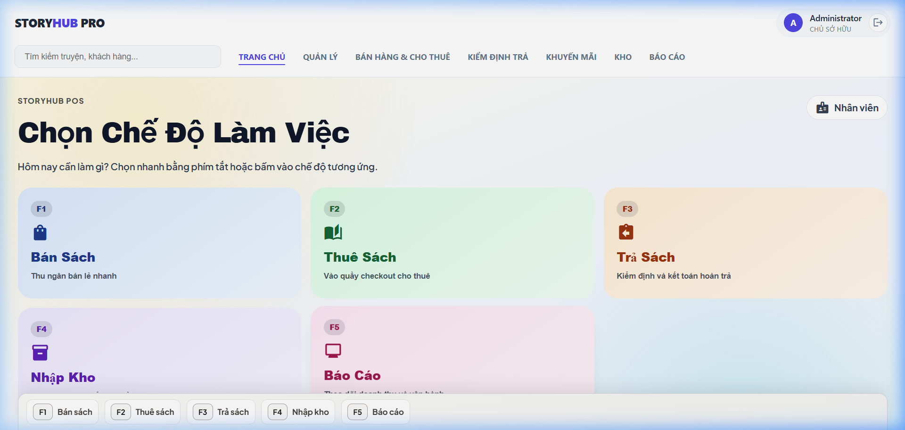
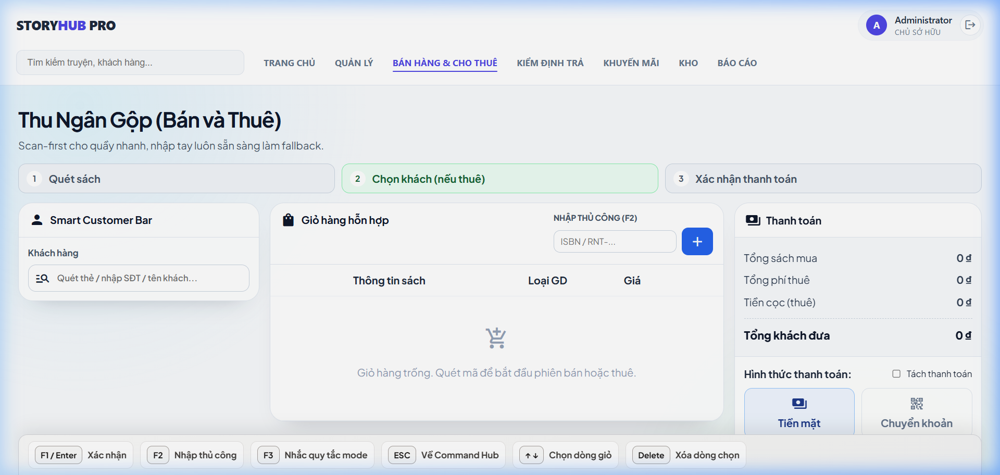
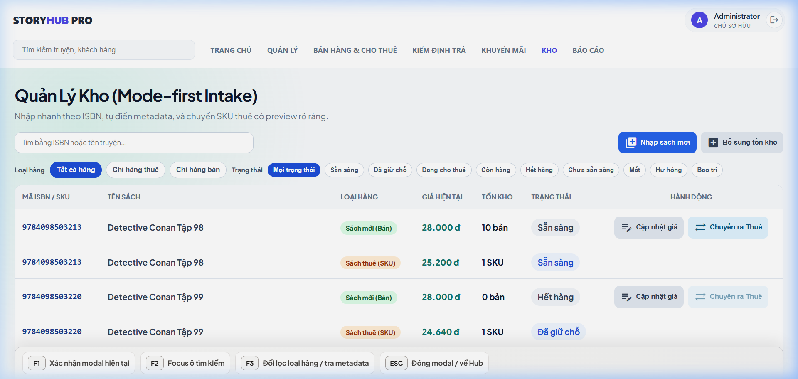
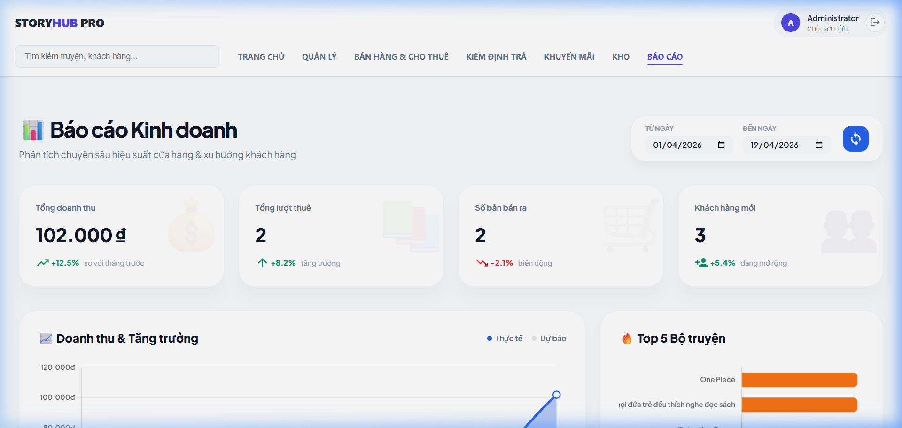
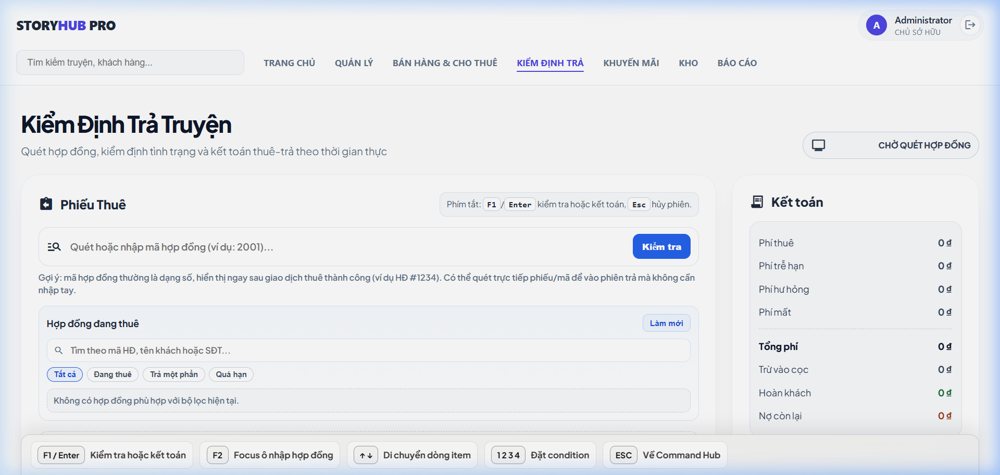
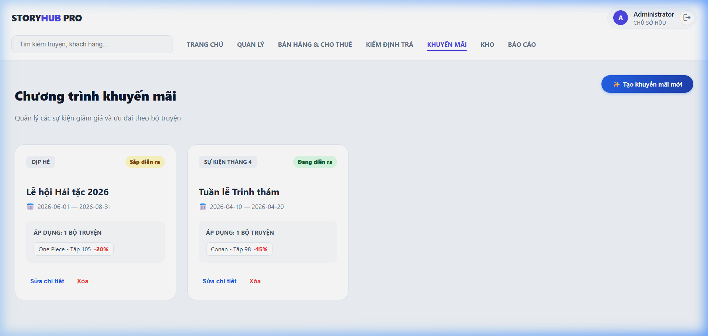
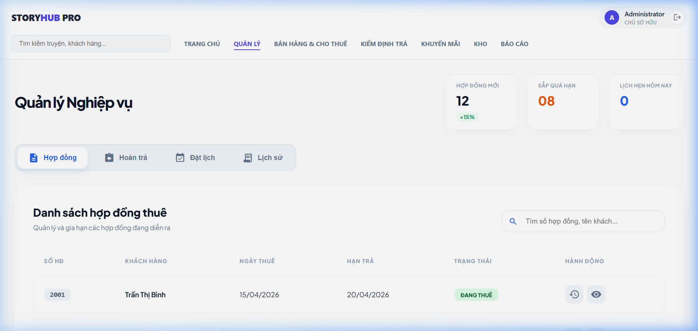

# 📚 StoryHub - Hệ thống Kiosk POS Chuyên Biệt cho Thuê & Bán Truyện



**StoryHub** là giải pháp quản lý bán lẻ và cho thuê sách/truyện comics thế hệ mới, được thiết kế theo mô hình **Desktop Kiosk**. Hệ thống tập trung vào hiệu năng cực cao, trải nghiệm "Zero-Friction" (không ma sát) và khả năng vận hành bền bỉ dựa trên triết lý **Intelligence-First**.

---

## 🏆 Tính năng Ưu việt (Superior Operations)

### ⚡ Quy trình Zero-Friction (Thanh toán 1-chạm)
StoryHub tối giản hóa mọi thao tác của thu ngân xuống mức thấp nhất:
- **Smart Auto-Routing:** Chỉ cần quét mã vạch, hệ thống tự động nhận diện:
    - **ISBN:** Tự động thêm vào giỏ hàng **Bán lẻ**.
    - **Physical SKU (RNT-):** Tự động nhận diện sách **Cho thuê**, tính tiền cọc và phí thuê.
- **Customer Smart-Memory:** Hệ thống tự động ghi nhớ và gợi ý thông tin khách thuê cho các lần sau, giúp rút ngắn 80% thời gian nhập liệu thông tin khách hàng.
- **Hóa đơn Hỗn hợp:** Xử lý Bán và Thuê trong duy nhất một đơn hàng, một lần thanh toán.

### 📦 Quản lý Kho Autopilot (Smart Inventory)
- **ISBN Metadata Sync:** Chỉ cần quét mã ISBN, hệ thống tự động kết nối với **Google Books API** để lấy toàn bộ thông tin: Tên truyện, Tác giả, Ảnh bìa, Mô tả, Thể loại... giúp việc nhập sách mới chỉ mất 5 giây.
- **Quản lý mã định danh Shop SKU:** Tự động tạo và quản lý mã tem riêng cho từng cuốn truyện vật lý, đảm bảo tracking 1-1 chính xác tuyệt đối.
- **Trạng thái Real-time:** Hiển thị trực quan trạng thái từng cuốn sách (Sẵn sàng, Đang thuê, Đã giữ chỗ, Cần bảo trì, Thất lạc).
- **Cập nhật giá linh hoạt:** Cho phép điều chỉnh giá gốc, giá thuê theo tập hoặc theo cả bộ truyện.

### 🔍 Kiểm định và Trả truyện Thông minh (Smart Return)
- **Digital Inspection:** Quy trình trả sách 4 bước tích hợp: Quét mã Hợp đồng -> Quét sách trả -> Kiểm tra tình trạng (Good/Torn/Liquid/Lost) -> Kết toán.
- **Tính toán Tự động:** Tự động tính phí thuê, tiền phạt quá hạn (Overdue) và phí bồi thường hư hỏng theo tỉ lệ phần trăm giá trị sách.
- **Hoàn cọc Minh bạch:** Hệ thống tự động khấu trừ các khoản phí vào tiền cọc và xuất hóa đơn hoàn trả chi tiết.

---

## 📸 Hệ thống giao diện (Real Screenshots)

````carousel

<!-- slide -->

<!-- slide -->

<!-- slide -->

<!-- slide -->

<!-- slide -->

<!-- slide -->

````

---

## ⌨️ Tương tác Siêu tốc (Keyboard-First)

Hệ thống hỗ trợ hệ thống phím tắt (Hotkeys) giúp thao tác nhanh mà không cần dùng chuột:

| Phím tắt | Chức năng |
| :--- | :--- |
| **F1** | Xác nhận thanh toán / Lưu modal hiện tại |
| **F2** | Chuyển nhanh tới ô Tìm kiếm (Global Search) |
| **F3** | Chuyển đổi bộ lọc (Bán lẻ <-> Cho thuê) / Tra cứu ISBN |
| **1 - 4** | Chọn nhanh tình trạng sách trong màn hình Trả truyện |
| **ESC** | Hủy lệnh / Đóng Modal / Quay về màn hình chính |
| **DELETE** | Xóa nhanh item khỏi giỏ hàng |

---

## 📊 Báo cáo & Phân tích (Advanced Insights)

Trang báo cáo của StoryHub cung cấp cái nhìn 360 độ về hiệu suất cửa hàng:
- **Revenue Breakdown:** Phân tích chi tiết doanh thu từ 3 nguồn: Bán truyện, Cho thuê và Tiền phạt quá hạn.
- **Top Metrics:** Tỷ lệ trả trễ hạn, Sản phẩm sắp hết kho, Lợi nhuận ròng dự tính.
- **Bảng xếp hạng (Rankings):**
    - **Top Customers:** Những khách hàng có giá trị vòng đời (LTV) cao nhất.
    - **Hot Books:** Các bộ truyện có lượt thuê/bán cao nhất theo thời gian.
- **Audit Log:** Lịch sử chi tiết mọi giao dịch kèm theo hóa đơn điện tử có thể xem lại bất cứ lúc nào.
- **Hệ thống Backup:** Cho phép tạo bản sao lưu dữ liệu (Full/Incremental) để đảm bảo an toàn tuyệt đối.

---

## 📅 Chức năng Đặt trước & Giữ chỗ (Reservation)
StoryHub hỗ trợ module **Lịch hẹn** chuyên dụng:
- Cho phép khách hàng đặt giữ chỗ các tập truyện HOT đang có người khác thuê.
- Tự động cảnh báo khi sách khách đặt đã được trả về kho.
- Quản lý danh sách chờ theo thứ tự ưu tiên thời gian.

---

## 🧬 Kiến trúc Kỹ thuật (Technical Architecture)

- **Frontend:** Vue 3 + Tauri Desktop Frame (Hiệu năng vượt trội, dung lượng cực nhẹ).
- **Scanner Logic:** Sử dụng bộ đệm 50ms thông minh để phân biệt chính xác giữa máy quét tốc độ cao và bàn phím.
- **Backend:** FastAPI + SQLAlchemy (Xử lý bất đồng bộ, không bao giờ gây giật lag UI).
- **Database:** SQLite (Local-first) - Dữ liệu nằm hoàn toàn trong tầm kiểm soát của bạn.

---

## 🚀 Hướng dẫn triển khai nhanh (Windows)

```powershell
# Clone và tự động cài đặt môi trường
git clone https://github.com/hoclaptrinh33/StoryHub.git
cd StoryHub
powershell -ExecutionPolicy Bypass -File scripts/setup.ps1

# Khởi chạy ứng dụng
# 1. Chạy Backend (Terminal 1): scripts/dev-backend.ps1
# 2. Chạy Frontend (Terminal 2): cd frontend; npm run tauri:dev
```

---
*StoryHub - Mang công nghiệp 4.0 vào văn hóa đọc truyền thống.*
huê/trả, không có quyền sửa giá hoặc xóa lịch sử.

### Cài đặt nhanh
1. **Clone & Setup:**
   ```powershell
   git clone https://github.com/hoclaptrinh33/StoryHub.git
   cd StoryHub
   powershell -ExecutionPolicy Bypass -File scripts/setup.ps1
   ```
2. **Khởi động:**
   Chạy đồng thời Backend (`scripts/dev-backend.ps1`) và Frontend Tauri (`npm run tauri:dev` trong folder frontend).

---

## 🗺️ Lộ trình nâng cấp (Roadmap)
- [x] **v0.1:** Core POS & Inventory (Stable).
- [x] **v0.2:** Promotion & Return Inspection (Beta).
- [ ] **v0.5:** Tích hợp in hóa đơn nhiệt và quét thẻ thành viên NFC.
- [ ] **v1.0:** Hệ thống đồng bộ đám mây và báo cáo qua Telegram Bot.

---
*StoryHub - Mang công nghệ hiện đại vào nét đẹp truyền thống của văn hóa đọc.*
