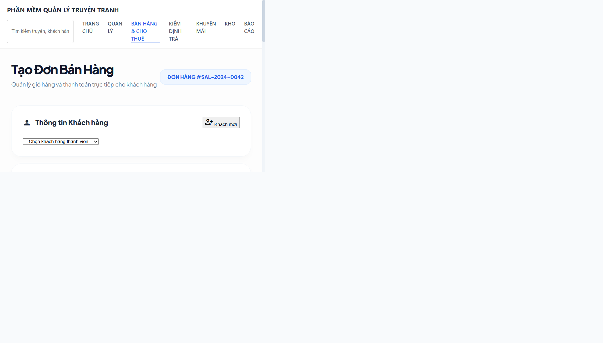
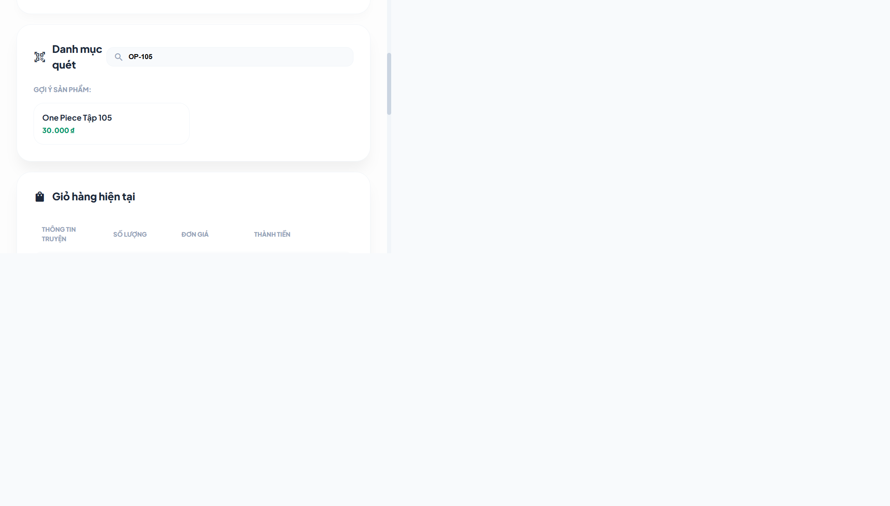
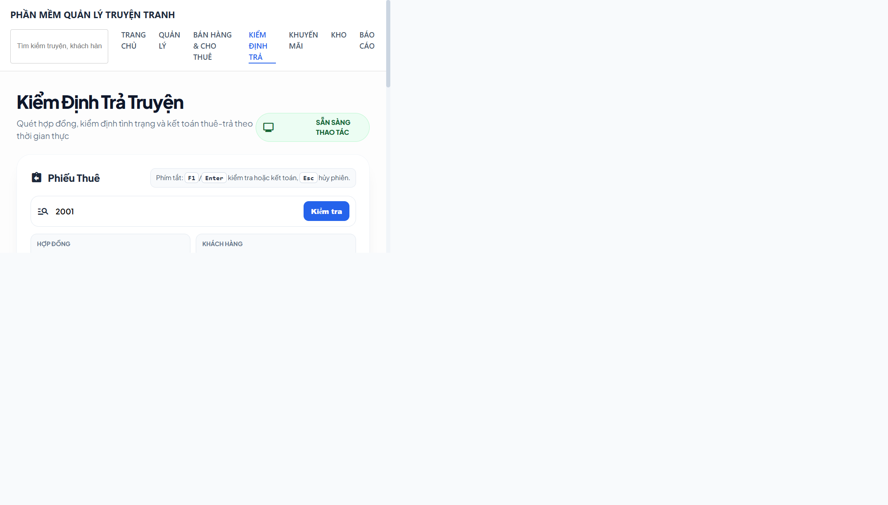

# Smoke checklist Phase 4 (POS + Kiểm định trả)

Ngày chạy: 2026-04-18

Mục tiêu: xác nhận nhanh 2 luồng nghiệp vụ chính ở mức vận hành nội bộ.

## 1) Bằng chứng ảnh minh họa

### POS sau patch 3 cột

- Tổng quan đầu trang: 
- Vùng danh mục quét và giỏ hàng: 

### Kiểm định trả với hợp đồng thật

- Màn return đã nạp hợp đồng `2001`: 

## 2) Checklist smoke

### POS checkout

- [x] Truy cập route `/ban-hang` thành công.
- [x] Hiển thị bố cục rõ 3 cột: cột khách hàng + danh mục quét, cột giỏ hàng, cột thanh toán.
- [x] Tìm sản phẩm theo mã (ví dụ `OP-105`) hoạt động.
- [x] Thêm item vào giỏ và cập nhật tạm tính hoạt động.
- [x] Bấm `F1` khi giỏ rỗng hiển thị cảnh báo hợp lệ (không vỡ luồng).

### Kiểm định trả

- [x] Truy cập route `/hoan-tra` thành công.
- [x] Nhập mã hợp đồng `2001` và bấm kiểm tra tải đúng dữ liệu backend.
- [x] Hiển thị customer, hạn trả, cọc còn lại và danh sách item đang thuê.
- [x] Hiển thị trạng thái màn `Sẵn sàng thao tác` sau khi nạp hợp đồng.

## 3) Lệnh xác thực kỹ thuật

- Frontend type-check:
  - `npm run type-check` (thư mục `frontend`) -> pass
- Backend rental tests:
  - `python -m pytest tests/test_phase3_rental.py -q` (thư mục `backend`) -> `6 passed`

## 4) Kết luận smoke

- Kết quả: PASS cho scope Phase 4 đã triển khai.
- Ghi chú: checklist này là smoke nhanh; chưa thay thế UAT đầy đủ theo checklist tổng tại [docs/how-to/howto_project-implementation-steps.md](howto_project-implementation-steps.md).
