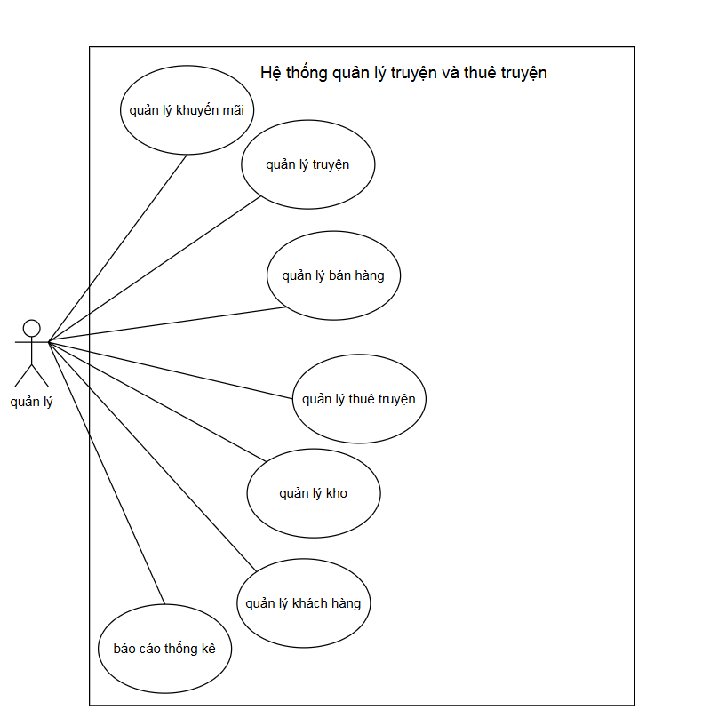

1.BỐI CẢNH XÂY DỰNG
- Đối tượng hướng đến là cửa hàng offline bán truyện  và cho thuê truyện  truyền thống. Nhu cầu xây dựng phần mềm để tiết kiệm tài nguyên và tối ưu chi phí, kiểm soát dữ liệu và giảm thiểu sai sót, hỗ trợ đưa ra quyết định
2. CÁC CHỨC NĂNG CHÍNH
2.1. Quản lý truyện
- Thêm / sửa / xoá truyện
-Phân loại (thể loại, tác giả, NXB)
-Quản lý trạng thái:
    + Còn hàng
    + Đang cho thuê
    + Hết hàng
2.2. Quản lý bán hàng
- Tạo đơn hàng
- Thêm sản phẩm vào đơn
- Tính tổng tiền
- Áp dụng khuyến mãi
- Thanh toán (tiền mặt, chuyển khoản)
- In hoá đơn
2.3. Quản lý cho thuê truyện 
- Tạo phiếu thuê
- Chọn truyện để thuê
- Quy định:
    + Ngày thuê
    + Ngày trả
    + Giá thuê
- Tiền cọc
- Trả truyện:
    + Tính phí trễ
    + Kiểm tra hư hỏng / mất
- Cập nhật trạng thái truyện
2.4. Quản lý khách hàng
- Thêm / sửa thông tin
- Lịch sử mua & thuê
- Phân loại khách (VIP, thường)
2.5. Quản lý kho
- Số lượng tồn
- Nhập hàng
- Xuất hàng
- Theo dõi truyện đang cho thuê
2.6. Quản lý thanh toán
- Ghi nhận giao dịch
- Theo dõi trạng thái:
    + Đã thanh toán
    + Chưa thanh toán
- Hoàn tiền (nếu trả truyện sớm hoặc cọc)
3. CHỨC NĂNG BỔ SUNG
3.1. Tìm kiếm & lọc
- Theo tên truyện
- Theo thể loại
- Theo trạng thái (còn / đang thuê)
3.2. Quản lý khuyến mãi
- Giảm giá bán
- Giảm giá thuê
- Combo truyện
3.3. Thông báo
- Nhắc khách trả truyện
- Cảnh báo quá hạn
- Gửi email/SMS
3.4. Báo cáo – thống kê
- Doanh thu bán
- Doanh thu thuê
- Truyện hot
- Khách hàng thân thiết
3.5. Quản lý nhân viên
- Phân quyền (admin, nhân viên)
- Theo dõi hoạt động
3.6. Lịch sử & audit log
- Ai sửa gì
- Khi nào
- Tránh gian lận
4.Đối tượng tác động vào chức năng hệ thống

Tác nhân là quản lý
Thực hiện các chức năng quản lý như: quản lý truyện , quản lý bán hàng, quản lý thuê truyện...
5. Luồng xử lý các tác vụ chính
5.1 Luồng xử lý bán hàng
    1. Nhân viên chọn "Tạo đơn hàng".
    2. Hệ thống kiểm tra trạng thái truyện. Chỉ những truyện có trạng thái "Còn hàng" mới được thêm vào đơn.
    3. Hệ thống tự động tính tổng tiền và áp dụng mã khuyến mãi (nếu có).
    4. Khách hàng chọn phương thức (Tiền mặt/Chuyển khoản).
    5. Hệ thống trừ số lượng tồn kho, in hóa đơn và ghi nhận vào lịch sử giao dịch.
5.2 Luồng xử lý Cho thuê truyện
    1. Tạo phiếu, chọn truyện (chỉ cho phép truyện trạng thái "Còn hàng").
    2. Ghi nhận tiền cọc vào hệ thống thanh toán.
    3. Hệ thống giảm số lượng truyện trạng thái " còn hàng"
5.3 Luồng Quản lý Kho
    Nhập hàng: Tăng số lượng tồn, cập nhật thông tin nhà xuất bản (NXB).
    Xuất hàng:
                + Nếu bán: Giảm số lượng tồn kho.
                + Nếu cho thuê: giảm số lượng tạm thời
5.4  Luồng Trả truyện
    1. Tìm phiếu thuê đang mở.
    2.Nhập ngày trả thực tế, kiểm tra hư hỏng/mất.
    3. Hệ thống tính phí trễ (nếu có) và phí bồi thường.
    4. Xác nhận thanh toán phát sinh (hoặc hoàn cọc).
    5.Cập nhật trạng thái truyện thành "Còn hàng", tăng tồn kho, đóng phiếu.
5.5 Luồng báo cáo 
    1. Chọn loại báo cáo (doanh thu bán, doanh thu thuê, truyện hot, khách thân thiết).
    2.Chọn khoảng thời gian.
    3. Hệ thống tổng hợp và hiển thị dạng bảng/biểu đồ.

